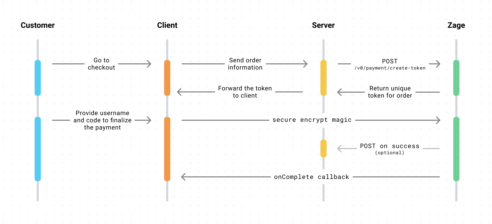

# Accept Payments using Zage

Zage provides embedded libraries with delightful components on the web that make accepting payments a walk in the park.

- Create a token for the order with the amount (_in cents_) on the server-side.
- Pass the token to Zage on the client-side.
- Let Zage do its **magic**.
- Get `onComplete` callback for a successful payment or `onExit` callback if the user abandons the process on the client-side (_optional_: we also provide a [`webhook`](#Optional-Webhook) integration).

## Demo

This repository is setup with sample code and environment to act as a sandbox for testing the full integration. You can follow the steps below to run a quick demo on your local machine.

```sh
git clone https://github.com/zage-inc/zage-samples.git
cd zage-samples
npm run setup
npm run start
```


## Setup

This section walks through the logic required on the server side and the client side to accept payments using Zage. The example below uses the [`zage-python`](https://pypi.org/project/zage) package for the server side and the [`zage-js`](https://www.npmjs.com/org/zage) package for the client side.

### Server Side

```sh
pip install zage
```

```py
import zage

zage.secret_key = "zage-test-key"

# returns: { "token": "test-token-111" }
json_response_obj = zage.Payment.create_token(
    # in cents (i.e. this is 10 dollars)
    amount=1000,
    # optional: a RESTful endpoint (on the backend) to be called
    # when the payment is successfully created.
    on_success_endpoint="https://zage.app/on_success",
    # optional: any internal metadata which will be passed
    # back to the on_success_endpoint
    metadata={"a": "b", "c": "d"},
)
```

([code](https://github.com/zage-inc/zage-samples/blob/master/backend/django/merchant/views.py))

### Client Side

The [`zage-js`](https://www.npmjs.com/org/zage) package includes TypeScript declarations for Zage.js.

```sh
npm install @zage/zage-js
```

```js
import { loadZage } from "@zage/zage-js";

const PUBLIC_KEY = "zage-test-key";
// load the zage object with your public key
const zage = await loadZage(PUBLIC_KEY);

// uses the token from the backend to start payment process
// onComplete: callback when the payment is successfully completed
// onExit: callback if the user exists before completing the payment
zage.openPayment(token, onComplete, onExit);
```

([code](https://github.com/zage-inc/zage-samples/blob/master/frontend/react/src/App.js))

### Optional Webhook

We provide the options to send an `on_success_endpoint` and `metadata` when you create a token. We will send a **POST** request to the `on_success_endpoint` when the payment is run successfully. The endpoint will receive the following response after a successful payment.

```json
{
  "paymentId": "py_123abc",
  "amount": 1000,
  "userId": "uid_123abc",
  "metadata": "{ \"a\": \"b\", \"c\": \"d\" }",
  "token": "test-token-111"
}
```

(please note that metadata is returned as a **JSON string**)

This request will include a header `ZAGE_SECRET_KEY` with the token created when initating the payment so that the webhook can verify the legitimacy of the request.

**IMPORTANT**: If the `on_success_endpoint` is provided while creating the token but we are unable to make the **POST** request, we will **still complete the payment and call onComplete on the client-side**.

### Returning Data to the frontend

If the webhook returns a payload with a 200 status code after the POST request, Zage will pass that information back to the `onComplete` method on the client side. `onComplete` is only called once the payment has been completed via Zage and the webhook has been called, so the frontend can ensure the transaction is complete at this point.

## Flow



## Stuff

- If you are looking for a logo/icon to add within the payment methods, please find image at [`images/logo.png`](https://github.com/zage-inc/zage-samples/blob/master/images/logo.png).
- If you have questions, comments, or need help with code, we're here to help: [cole@zage.app](mailto:cole@zage.app?subject=[GitHub]%20zage-samples) and [arsh@zage.app](mailto:arsh@zage.app?subject=[GitHub]%20zage-samples).
